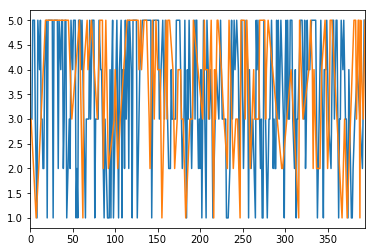

# Machine Learning Engineer Nanodegree
## Supervised Learning
## Project: Building a Student Intervention System

Welcome to the second project of the Machine Learning Engineer Nanodegree! In this notebook, some template code has already been provided for you, and it will be your job to implement the additional functionality necessary to successfully complete this project. Sections that begin with **'Implementation'** in the header indicate that the following block of code will require additional functionality which you must provide. Instructions will be provided for each section and the specifics of the implementation are marked in the code block with a `'TODO'` statement. Please be sure to read the instructions carefully!

In addition to implementing code, there will be questions that you must answer which relate to the project and your implementation. Each section where you will answer a question is preceded by a **'Question X'** header. Carefully read each question and provide thorough answers in the following text boxes that begin with **'Answer:'**. Your project submission will be evaluated based on your answers to each of the questions and the implementation you provide.  

>**Note:** Code and Markdown cells can be executed using the **Shift + Enter** keyboard shortcut. In addition, Markdown cells can be edited by typically double-clicking the cell to enter edit mode.

### Question 1 - Classification vs. Regression
*Your goal for this project is to identify students who might need early intervention before they fail to graduate. Which type of supervised learning problem is this, classification or regression? Why?*

**Answer: **

This is a classification problem as the output variable takes class labels (pass,fail) as opposed to continuous values (such as the probability of a student passing/failing). The problem requires us to fit a model to a training set and predict for the given set of student data if the student passes or fails. If he is slated to fail, he is recommended for an intervention. This is a binomial classification problem. 

## Exploring the Data
Run the code cell below to load necessary Python libraries and load the student data. Note that the last column from this dataset, `'passed'`, will be our target label (whether the student graduated or didn't graduate). All other columns are features about each student.


```python
# Import libraries
import numpy as np
import pandas as pd
from time import time
from sklearn.metrics import f1_score

# Read student data
student_data = pd.read_csv("student-data.csv")
print "Student data read successfully!"

print type(student_data)
print list(student_data)
print student_data.head(n=5)
print student_data.describe()

```

    Student data read successfully!
    <class 'pandas.core.frame.DataFrame'>
    ['school', 'sex', 'age', 'address', 'famsize', 'Pstatus', 'Medu', 'Fedu', 'Mjob', 'Fjob', 'reason', 'guardian', 'traveltime', 'studytime', 'failures', 'schoolsup', 'famsup', 'paid', 'activities', 'nursery', 'higher', 'internet', 'romantic', 'famrel', 'freetime', 'goout', 'Dalc', 'Walc', 'health', 'absences', 'passed']
      school sex  age address famsize Pstatus  Medu  Fedu     Mjob      Fjob  \
    0     GP   F   18       U     GT3       A     4     4  at_home   teacher   
    1     GP   F   17       U     GT3       T     1     1  at_home     other   
    2     GP   F   15       U     LE3       T     1     1  at_home     other   
    3     GP   F   15       U     GT3       T     4     2   health  services   
    4     GP   F   16       U     GT3       T     3     3    other     other   
    
       ...   internet romantic  famrel  freetime  goout Dalc Walc health absences  \
    0  ...         no       no       4         3      4    1    1      3        6   
    1  ...        yes       no       5         3      3    1    1      3        4   
    2  ...        yes       no       4         3      2    2    3      3       10   
    3  ...        yes      yes       3         2      2    1    1      5        2   
    4  ...         no       no       4         3      2    1    2      5        4   
    
      passed  
    0     no  
    1     no  
    2    yes  
    3    yes  
    4    yes  
    
    [5 rows x 31 columns]
                  age        Medu        Fedu  traveltime   studytime    failures  \
    count  395.000000  395.000000  395.000000  395.000000  395.000000  395.000000   
    mean    16.696203    2.749367    2.521519    1.448101    2.035443    0.334177   
    std      1.276043    1.094735    1.088201    0.697505    0.839240    0.743651   
    min     15.000000    0.000000    0.000000    1.000000    1.000000    0.000000   
    25%     16.000000    2.000000    2.000000    1.000000    1.000000    0.000000   
    50%     17.000000    3.000000    2.000000    1.000000    2.000000    0.000000   
    75%     18.000000    4.000000    3.000000    2.000000    2.000000    0.000000   
    max     22.000000    4.000000    4.000000    4.000000    4.000000    3.000000   
    
               famrel    freetime       goout        Dalc        Walc      health  \
    count  395.000000  395.000000  395.000000  395.000000  395.000000  395.000000   
    mean     3.944304    3.235443    3.108861    1.481013    2.291139    3.554430   
    std      0.896659    0.998862    1.113278    0.890741    1.287897    1.390303   
    min      1.000000    1.000000    1.000000    1.000000    1.000000    1.000000   
    25%      4.000000    3.000000    2.000000    1.000000    1.000000    3.000000   
    50%      4.000000    3.000000    3.000000    1.000000    2.000000    4.000000   
    75%      5.000000    4.000000    4.000000    2.000000    3.000000    5.000000   
    max      5.000000    5.000000    5.000000    5.000000    5.000000    5.000000   
    
             absences  
    count  395.000000  
    mean     5.708861  
    std      8.003096  
    min      0.000000  
    25%      0.000000  
    50%      4.000000  
    75%      8.000000  
    max     75.000000  
    

### Implementation: Data Exploration
Let's begin by investigating the dataset to determine how many students we have information on, and learn about the graduation rate among these students. In the code cell below, you will need to compute the following:
- The total number of students, `n_students`.
- The total number of features for each student, `n_features`.
- The number of those students who passed, `n_passed`.
- The number of those students who failed, `n_failed`.
- The graduation rate of the class, `grad_rate`, in percent (%).


```python
# TODO: Calculate number of students
n_students = len(student_data)

# TODO: Calculate number of features
n_features = len(student_data.columns)

# TODO: Calculate passing students
n_passed = len(student_data[student_data["passed"] == "yes"])

# TODO: Calculate failing students
n_failed = len(student_data[student_data["passed"] == "no"])

# TODO: Calculate graduation rate
grad_rate = float(n_passed*1.0 / n_students*1.0)*100

# Print the results
print "Total number of students: {}".format(n_students)
print "Number of features: {}".format(n_features)
print "Number of students who passed: {}".format(n_passed)
print "Number of students who failed: {}".format(n_failed)
print "Graduation rate of the class: {:.2f}%".format(grad_rate)
```

    Total number of students: 395
    Number of features: 31
    Number of students who passed: 265
    Number of students who failed: 130
    Graduation rate of the class: 67.09%
    

## Preparing the Data
In this section, we will prepare the data for modeling, training and testing.

### Identify feature and target columns
It is often the case that the data you obtain contains non-numeric features. This can be a problem, as most machine learning algorithms expect numeric data to perform computations with.

Run the code cell below to separate the student data into feature and target columns to see if any features are non-numeric.


```python
%matplotlib inline
student_data[student_data['passed'] == 'yes']['health'].plot()
student_data[student_data['passed'] == 'no']['health'].plot()

```


    <matplotlib.axes._subplots.AxesSubplot at 0xbb9a160>





```python
# Extract feature columns
feature_cols = list(student_data.columns[:-1])

# Extract target column 'passed'
target_col = student_data.columns[-1] 

# Show the list of columns
print "Feature columns:\n{}".format(feature_cols)
print "\nTarget column: {}".format(target_col)

# Separate the data into feature data and target data (X_all and y_all, respectively)
X_all = student_data[feature_cols]
y_all = student_data[target_col]

# Show the feature information by printing the first five rows
print "\nFeature values:"
print X_all.head()
```

    Feature columns:
    ['school', 'sex', 'age', 'address', 'famsize', 'Pstatus', 'Medu', 'Fedu', 'Mjob', 'Fjob', 'reason', 'guardian', 'traveltime', 'studytime', 'failures', 'schoolsup', 'famsup', 'paid', 'activities', 'nursery', 'higher', 'internet', 'romantic', 'famrel', 'freetime', 'goout', 'Dalc', 'Walc', 'health', 'absences']
    
    Target column: passed
    
    Feature values:
      school sex  age address famsize Pstatus  Medu  Fedu     Mjob      Fjob  \
    0     GP   F   18       U     GT3       A     4     4  at_home   teacher   
    1     GP   F   17       U     GT3       T     1     1  at_home     other   
    2     GP   F   15       U     LE3       T     1     1  at_home     other   
    3     GP   F   15       U     GT3       T     4     2   health  services   
    4     GP   F   16       U     GT3       T     3     3    other     other   
    
        ...    higher internet  romantic  famrel  freetime goout Dalc Walc health  \
    0   ...       yes       no        no       4         3     4    1    1      3   
    1   ...       yes      yes        no       5         3     3    1    1      3   
    2   ...       yes      yes        no       4         3     2    2    3      3   
    3   ...       yes      yes       yes       3         2     2    1    1      5   
    4   ...       yes       no        no       4         3     2    1    2      5   
    
      absences  
    0        6  
    1        4  
    2       10  
    3        2  
    4        4  
    
    [5 rows x 30 columns]
    

### Preprocess Feature Columns

As you can see, there are several non-numeric columns that need to be converted! Many of them are simply `yes`/`no`, e.g. `internet`. These can be reasonably converted into `1`/`0` (binary) values.

Other columns, like `Mjob` and `Fjob`, have more than two values, and are known as _categorical variables_. The recommended way to handle such a column is to create as many columns as possible values (e.g. `Fjob_teacher`, `Fjob_other`, `Fjob_services`, etc.), and assign a `1` to one of them and `0` to all others.

These generated columns are sometimes called _dummy variables_, and we will use the [`pandas.get_dummies()`](http://pandas.pydata.org/pandas-docs/stable/generated/pandas.get_dummies.html?highlight=get_dummies#pandas.get_dummies) function to perform this transformation. Run the code cell below to perform the preprocessing routine discussed in this section.


```python
def preprocess_features(X):
    ''' Preprocesses the student data and converts non-numeric binary variables into
        binary (0/1) variables. Converts categorical variables into dummy variables. '''
    
    # Initialize new output DataFrame
    output = pd.DataFrame(index = X.index)

    # Investigate each feature column for the data
    for col, col_data in X.iteritems():
        
        # If data type is non-numeric, replace all yes/no values with 1/0
        if col_data.dtype == object:
            col_data = col_data.replace(['yes', 'no'], [1, 0])

        # If data type is categorical, convert to dummy variables
        if col_data.dtype == object:
            # Example: 'school' => 'school_GP' and 'school_MS'
            col_data = pd.get_dummies(col_data, prefix = col)  
        
        # Collect the revised columns
        output = output.join(col_data)
    
    return output

X_all = preprocess_features(X_all)
print "Processed feature columns ({} total features):\n{}".format(len(X_all.columns), list(X_all.columns))
```

    Processed feature columns (48 total features):
    ['school_GP', 'school_MS', 'sex_F', 'sex_M', 'age', 'address_R', 'address_U', 'famsize_GT3', 'famsize_LE3', 'Pstatus_A', 'Pstatus_T', 'Medu', 'Fedu', 'Mjob_at_home', 'Mjob_health', 'Mjob_other', 'Mjob_services', 'Mjob_teacher', 'Fjob_at_home', 'Fjob_health', 'Fjob_other', 'Fjob_services', 'Fjob_teacher', 'reason_course', 'reason_home', 'reason_other', 'reason_reputation', 'guardian_father', 'guardian_mother', 'guardian_other', 'traveltime', 'studytime', 'failures', 'schoolsup', 'famsup', 'paid', 'activities', 'nursery', 'higher', 'internet', 'romantic', 'famrel', 'freetime', 'goout', 'Dalc', 'Walc', 'health', 'absences']
    

### Implementation: Training and Testing Data Split
So far, we have converted all _categorical_ features into numeric values. For the next step, we split the data (both features and corresponding labels) into training and test sets. In the following code cell below, you will need to implement the following:
- Randomly shuffle and split the data (`X_all`, `y_all`) into training and testing subsets.
  - Use 300 training points (approximately 75%) and 95 testing points (approximately 25%).
  - Set a `random_state` for the function(s) you use, if provided.
  - Store the results in `X_train`, `X_test`, `y_train`, and `y_test`.


```python
# TODO: Import any additional functionality you may need here
#from sklearn.cross_validation import train_test_split
from sklearn.cross_validation import StratifiedShuffleSplit

# TODO: Set the number of training points
num_train = 300

# Set the number of testing points
num_test = X_all.shape[0] - num_train

# TODO: Shuffle and split the dataset into the number of training and testing points above

#X_train, X_test, y_train, y_test = train_test_split(X_all, y_all, test_size=num_test, train_size=num_train, random_state=9)

strat_shuffle_split = StratifiedShuffleSplit(y_all, test_size=num_test, train_size=num_train, random_state=2)
for train_index, test_index in strat_shuffle_split: 
    X_train, X_test = X_all.iloc[train_index], X_all.iloc[test_index]
    y_train, y_test = y_all[train_index], y_all[test_index]


# Show the results of the split
print "Training set has {} samples.".format(X_train.shape[0])
print "Testing set has {} samples.".format(X_test.shape[0])


```

    Training set has 300 samples.
    Testing set has 95 samples.
    

    C:\Users\Sarita Navuluru\Anaconda2\lib\site-packages\sklearn\cross_validation.py:44: DeprecationWarning: This module was deprecated in version 0.18 in favor of the model_selection module into which all the refactored classes and functions are moved. Also note that the interface of the new CV iterators are different from that of this module. This module will be removed in 0.20.
      "This module will be removed in 0.20.", DeprecationWarning)
    

## Training and Evaluating Models
In this section, you will choose 3 supervised learning models that are appropriate for this problem and available in `scikit-learn`. You will first discuss the reasoning behind choosing these three models by considering what you know about the data and each model's strengths and weaknesses. You will then fit the model to varying sizes of training data (100 data points, 200 data points, and 300 data points) and measure the F<sub>1</sub> score. You will need to produce three tables (one for each model) that shows the training set size, training time, prediction time, F<sub>1</sub> score on the training set, and F<sub>1</sub> score on the testing set.

**The following supervised learning models are currently available in** [`scikit-learn`](http://scikit-learn.org/stable/supervised_learning.html) **that you may choose from:**
- Gaussian Naive Bayes (GaussianNB)
- Decision Trees
- Ensemble Methods (Bagging, AdaBoost, Random Forest, Gradient Boosting)
- K-Nearest Neighbors (KNeighbors)
- Stochastic Gradient Descent (SGDC)
- Support Vector Machines (SVM)
- Logistic Regression

### Question 2 - Model Application
*List three supervised learning models that are appropriate for this problem. For each model chosen*
- Describe one real-world application in industry where the model can be applied. *(You may need to do a small bit of research for this — give references!)* 
- What are the strengths of the model; when does it perform well? 
- What are the weaknesses of the model; when does it perform poorly?
- What makes this model a good candidate for the problem, given what you know about the data?

**Answer: **

I choose the following models.  The bulleted notes offer insights into the assumptions, strenghts, weakness and have been collected from varying sources online.

**1. Logistic Regression **

***what is logistic regression ***

Logistic regression is a classification algorithm that linearly divides the input space into two distinct regions, one for each binomial class. it explains the relationship between one dependent binary variable and one or more nominal, ordinal, interval or ratio-level independent variables. The fundamental condition is that the outcome variable is dichotomous and the predictors tend to a linear relationship.

***Real life examples ***

<ul>
<li>Industry usage (Penderson et. al 2014)
Classification of protein sequences https://www.ncbi.nlm.nih.gov/pubmed/24465495
Identify and automatically categorize protein sequences into one of 11 pre-defined classes
[Tremendous potential for further bioinformatics applications using Logistic Regression]
<li>How does the probability of getting lung cancer (yes vs. no) change for every additional pound of overweight and for every pack of cigarettes smoked per day?
<li>Do body weight calorie intake, fat intake, and participant age have an influence on heart attacks (yes vs. no)?
</ul>
***Assumptions ***

<ul>
<li> Binary logistic regression requires the dependent variable to be binary (measured on a dichotomous scale).

<li> You have one or more independent variables, which can be either continuous (i.e., an interval or ratio variable) or categorical (i.e., an ordinal or nominal variable).

<li> There should be no high intercorrelations (multicollinearity) among the predictors.  This can be assessed by a correlation matrix among the predictors.

<li> Logistic regression assumes that the dependent variable is a stochastic event.  

<li> You should have independence of observations and the dependent variable should have mutually exclusive and exhaustive categories.  

<li> Logistic regression assumes linearity of independent variables and log odds.  Whilst it does not require the dependent and independent variables to be related linearly, it requires that the independent variables are linearly related to the log odds. 

<li> There needs to be a linear relationship between any continuous independent variables and the logit transformation of the dependent variable.


<li> It requires quite large sample sizes.  
</ul>
***Strengths ***
<ul>
<li> It does not need a linear relationship between the dependent and independent variables.  Logistic regression can handle all sorts of relationships, because it applies a non-linear log transformation to the predicted odds ratio.  

<li> The independent variables do not need to be multivariate normal – although multivariate normality yields a more stable solution.  Also the error terms (the residuals) do not need to be multivariate normally distributed.  

<li> Homoscedasticity is not needed. Logistic regression does not need variances to be heteroscedastic for each level of the independent variables.  

<li> It can handle ordinal and nominal data as independent variables.  The independent variables do not need to be metric (interval or ratio scaled).

<li> Many ways to regularize the model to tolerate some errors and avoid over-fitting
</ul>
***Weaknesses ***
<ul>
<li> Performs poorly with high number of features or missing data. 

<li> Irrelevant features will produce undesired effects. Outliers are a problem because it tries to maximize likelihood using all training data.

<li> There should be no high intercorrelations

<li> Overfitting : Too many features can cause overfitting.

<li> It does better with large datasets.

</ul>
***How does it fit this data ? ***
<ul>
<li>The problem requires a binary classification.

<li>The data may or maynot have a linear relationship between the dependent and independent variables.

<li>This is not highly intercorrelated data.

<li>Average dataset size
</ul>

**2. Random Forest**


Random forests or random decision forests  are an ensemble learning method for classification, regression and other tasks, that operate by constructing a multitude of decision trees at training time and outputting the class that is the mode of the classes (classification) or mean prediction (regression) of the individual trees. 
Random Forests are fast, flexible, and represent a robust approach to mining high-dimensional data. They are an extension of classification and regression trees (CART). 

***Real world application***
<ul>
<li>Automatic recognition of loess landforms using Random Forest method
https://link.springer.com/article/10.1007/s11629-016-4320-9


<li>In the area of Bioinformatics, the Random Forest (RF) [6] technique, which includes an ensemble of decision trees and incorporates feature selection and interactions naturally in the learning process, is a popular choice.
https://link.springer.com/chapter/10.1007%2F978-1-4419-9326-7_11


<li>Modeling a System for Decision Support in Snow Avalanche Warning Using Balanced Random Forest and Weighted Random Forest
https://link.springer.com/chapter/10.1007/978-3-319-10554-3_8
</ul>
***Assumptions***
<ul>
<li>At each step of building individual tree we find the best split of data
<li>While building a tree we use not the whole dataset, but bootstrap sample
<li>We aggregate the individual tree outputs by averaging (actually 2 and 3 means together more general bagging procedure).
<li>Minimize Bias by growing trees sufficiently deep
<li>Reduce variance of noisy but unbiased trees by averaging
<li> Maximize variance reduction by minimizing correlation between trees by means of bootstrapping data for each tree
and sampling available variable-set at each node
</ul>

***Strenghts***
<ul>
<li>It is one of the most accurate learning algorithms available. For many data sets, it produces a highly accurate classifier.
<li>It runs efficiently on large databases. It is nonparametric, interpretable, efficient, and has high prediction accuracy for many types of data. 
<li>It handles correlated/redundant variables
<li>It can handle thousands of input variables without variable deletion- can handle lots of noise variable even with quite few relevant variables;It also performs well even in the presence of a large number of features and a small number of observations. 
<li>It gives estimates of what variables are important in the classification.
<li>It generates an internal unbiased estimate of the generalization error as the forest building progresses; with increasing number of variables the bias usually decreases
<li>It has an effective method for estimating missing data and maintains accuracy when a large proportion of the data are missing.
<li>It has methods for balancing error in class population unbalanced data sets.
<li>It computes proximities between pairs of cases/observations (can handle strong and local interactions very well) that can be used in clustering, locating outliers(robust against outliers in the predictive variables), or (by scaling) give interesting views of the data. The capabilities of the above can be extended to unlabeled data, leading to unsupervised clustering, data views and outlier detection.
<li>It is very easy to handle – no distribution assumptions -> no transformation
<li>Can easily handle qualitative (categorical) features
<li>Out of bag (OOB) estimates can be used for model validation 
</ul>

***Weaknesses***
<ul>
<li>Unlike decision trees, the classifications made by random forests are difficult for humans to interpret.

<li>For data including categorical variables with different number of levels, random forests are biased in favor of those attributes with more levels. Therefore, the variable importance scores from random forest are not reliable for this type of data. Methods such as partial permutations were used to solve the problem.

<li>If the data contain groups of correlated features of similar relevance for the output, then smaller groups are favored over larger groups.

</ul>

***Applicability to the given data***
<ul>

<li>They perform well even in the presence of a large number of features and a small number of observations. 
<li>It is nonparametric, interpretable, efficient, and has high prediction accuracy for many types of data including moderately correlated data.
</ul>

**3. SVM **
A Support Vector Machine (SVM) is a discriminative classifier formally defined by a separating hyperplane. In other words, given labeled training data (supervised learning), the algorithm outputs an optimal hyperplane which categorizes new examples. It behaves like logistic regression in linear data spaces. Its nonlinear kernel is used when data is not linearly separable.

***Real World Applications***
The support vector machine is a supervised learning technique for classification increasingly used in many applications of data mining, engineering, and bioinformatics; ; for instance, hand-written digit recognition, text categorization, and tumor classification with genomic profiles.
<ul>
<li>Diagnosis of functional failures at the board level is critical for improving product yield and reducing manufacturing cost. https://link.springer.com/chapter/10.1007/978-3-319-40210-9_2
<li>Learning to Classify Text Using Support Vector Machines https://link.springer.com/book/10.1007/978-1-4615-0907-3
</ul>

***Strengths***
<ul>
<li>Avoids localization problems
<li>Can use the kernel trick
<li>Accurate with small and clean datasets
<li>Effecient since it only uses a subset of the data
</ul>
***Weaknesses***
<ul>
<li>Sensitive to noise (may need to drop some features that are causing noise)

<li>Can be painful to train with large datasets
</ul>
***Reasons for Choosing***
SVMs can do well when with a small set as long as the number of data points is larger than the number of features being considered.


### Setup
Run the code cell below to initialize three helper functions which you can use for training and testing the three supervised learning models you've chosen above. The functions are as follows:
- `train_classifier` - takes as input a classifier and training data and fits the classifier to the data.
- `predict_labels` - takes as input a fit classifier, features, and a target labeling and makes predictions using the F<sub>1</sub> score.
- `train_predict` - takes as input a classifier, and the training and testing data, and performs `train_clasifier` and `predict_labels`.
 - This function will report the F<sub>1</sub> score for both the training and testing data separately.


```python
def train_classifier(clf, X_train, y_train):
    ''' Fits a classifier to the training data. '''
    
    # Start the clock, train the classifier, then stop the clock
    start = time()
    clf.fit(X_train, y_train)
    end = time()
    
    # Print the results
    print "Trained model in {:.4f} seconds".format(end - start)

    
def predict_labels(clf, features, target):
    ''' Makes predictions using a fit classifier based on F1 score. '''
    
    # Start the clock, make predictions, then stop the clock
    start = time()
    y_pred = clf.predict(features)
    end = time()
    
    # Print and return results
    print "Made predictions in {:.4f} seconds.".format(end - start)
    return f1_score(target.values, y_pred, pos_label='yes')


def train_predict(clf, X_train, y_train, X_test, y_test):
    ''' Train and predict using a classifer based on F1 score. '''
    
    # Indicate the classifier and the training set size
    print "Training a {} using a training set size of {}. . .".format(clf.__class__.__name__, len(X_train))
    
    # Train the classifier
    train_classifier(clf, X_train, y_train)
    
    # Print the results of prediction for both training and testing
    print "F1 score for training set: {:.4f}.".format(predict_labels(clf, X_train, y_train))
    print "F1 score for test set: {:.4f}.".format(predict_labels(clf, X_test, y_test))
```

### Implementation: Model Performance Metrics
With the predefined functions above, you will now import the three supervised learning models of your choice and run the `train_predict` function for each one. Remember that you will need to train and predict on each classifier for three different training set sizes: 100, 200, and 300. Hence, you should expect to have 9 different outputs below — 3 for each model using the varying training set sizes. In the following code cell, you will need to implement the following:
- Import the three supervised learning models you've discussed in the previous section.
- Initialize the three models and store them in `clf_A`, `clf_B`, and `clf_C`.
 - Use a `random_state` for each model you use, if provided.
 - **Note:** Use the default settings for each model — you will tune one specific model in a later section.
- Create the different training set sizes to be used to train each model.
 - *Do not reshuffle and resplit the data! The new training points should be drawn from `X_train` and `y_train`.*
- Fit each model with each training set size and make predictions on the test set (9 in total).  
**Note:** Three tables are provided after the following code cell which can be used to store your results.


```python
# TODO: Import the three supervised learning models from sklearn

from sklearn.linear_model import LogisticRegression
from sklearn.svm import SVC
from sklearn.ensemble import RandomForestClassifier

#from sklearn.naive_bayes import GaussianNB
#from sklearn.ensemble import GradientBoostingClassifier
#from sklearn.ensemble import BaggingClassifier
#from sklearn.neighbors import KNeighborsClassifier
#from sklearn.ensemble import AdaBoostClassifier
#from sklearn import tree


#my_random_state = None

# TODO: Initialize the three models
clf_A = LogisticRegression()
clf_B = SVC()
clf_C = RandomForestClassifier(n_estimators = 100)

#Explore other options
#clf_D = GaussianNB()
#clf_E = GradientBoostingClassifier(random_state=my_random_state)
#clf_F = BaggingClassifier(KNeighborsClassifier())
#clf_F = tree.DecisionTreeClassifier()
#clf_G = KNeighborsClassifier()


classifiers = [clf_A,clf_B,clf_C]

#Explore
#classifiers = [clf_E,clf_G]
#classifiers = [clf_G,clf_F]
#classifiers = [clf_F,clf_A,clf_B,clf_C]
#classifiers = [clf_A,clf_B,clf_C,clf_D,clf_E,clf_F,clf_G]

# TODO: Set up the training set sizes (as per instruction, do not reshuffle the data)
X_train_100 = X_train[:100]
y_train_100 = y_train[:100]

X_train_200 = X_train[:200]
y_train_200 = y_train[:200]

X_train_300 = X_train[:300]
y_train_300 = y_train[:300]

train_sets = [(X_train_100,y_train_100),(X_train_200,y_train_200),(X_train_300,y_train_300)]

# TODO: Execute the 'train_predict' function for each classifier and each training set size
for clf in classifiers:
    for X_train,y_train in train_sets:
        train_predict(clf, X_train, y_train, X_test, y_test)
        
        
```

    Training a LogisticRegression using a training set size of 100. . .
    Trained model in 0.0160 seconds
    Made predictions in 0.0000 seconds.
    F1 score for training set: 0.8671.
    Made predictions in 0.0000 seconds.
    F1 score for test set: 0.7971.
    Training a LogisticRegression using a training set size of 200. . .
    Trained model in 0.0000 seconds
    Made predictions in 0.0000 seconds.
    F1 score for training set: 0.8333.
    Made predictions in 0.0000 seconds.
    F1 score for test set: 0.8030.
    Training a LogisticRegression using a training set size of 300. . .
    Trained model in 0.0000 seconds
    Made predictions in 0.0000 seconds.
    F1 score for training set: 0.8330.
    Made predictions in 0.0000 seconds.
    F1 score for test set: 0.8000.
    Training a SVC using a training set size of 100. . .
    Trained model in 0.0150 seconds
    Made predictions in 0.0000 seconds.
    F1 score for training set: 0.8272.
    Made predictions in 0.0000 seconds.
    F1 score for test set: 0.8050.
    Training a SVC using a training set size of 200. . .
    Trained model in 0.0000 seconds
    Made predictions in 0.0000 seconds.
    F1 score for training set: 0.8562.
    Made predictions in 0.0000 seconds.
    F1 score for test set: 0.7660.
    Training a SVC using a training set size of 300. . .
    Trained model in 0.0060 seconds
    Made predictions in 0.0000 seconds.
    F1 score for training set: 0.8621.
    Made predictions in 0.0000 seconds.
    F1 score for test set: 0.7972.
    Training a RandomForestClassifier using a training set size of 100. . .
    Trained model in 0.2680 seconds
    Made predictions in 0.0480 seconds.
    F1 score for training set: 1.0000.
    Made predictions in 0.0470 seconds.
    F1 score for test set: 0.8000.
    Training a RandomForestClassifier using a training set size of 200. . .
    Trained model in 0.2060 seconds
    Made predictions in 0.0470 seconds.
    F1 score for training set: 1.0000.
    Made predictions in 0.0470 seconds.
    F1 score for test set: 0.7883.
    Training a RandomForestClassifier using a training set size of 300. . .
    Trained model in 0.2450 seconds
    Made predictions in 0.0450 seconds.
    F1 score for training set: 1.0000.
    Made predictions in 0.0480 seconds.
    F1 score for test set: 0.7832.
    

### Tabular Results
Edit the cell below to see how a table can be designed in [Markdown](https://github.com/adam-p/markdown-here/wiki/Markdown-Cheatsheet#tables). You can record your results from above in the tables provided.

** Classifer 1 - Logistic Regression  **

| Training Set Size | Training Time | Prediction Time (test) | F1 Score (train) | F1 Score (test) |
| :---------------: | :---------------------: | :--------------------: | :--------------: | :-------------: |
| 100               |        0.0160           |        0.0000          |     0.8671       |   0.7971.       |                 
| 200               |        0.0000           |        0.0000          |     0.8383       |   0.8030        |                 
| 300               |        0.0000           |        0.0000          |     0.8330       |   0.8000        |

** Classifer 2 - SVC **

| Training Set Size | Training Time | Prediction Time (test) | F1 Score (train) | F1 Score (test) |
| :---------------: | :---------------------: | :--------------------: | :--------------: | :-------------: |
| 100               |        0.0150            |     0.0000                   |  0.8272                |         0.8050        |
| 200               |     0.0           |          0.0000              |      0.8562            |0.7660|
| 300               |      0.0060                   |  0.0000                      |  0.8621               |     0.0.7972     |

** Classifer 3 - Random Forest **

| Training Set Size | Training Time | Prediction Time (test) | F1 Score (train) | F1 Score (test) |
| :---------------: | :---------------------: | :--------------------: | :--------------: | :-------------: |
| 100               |        0.2680                |      0.0480                   |   1.0000               |           0.8000      |
| 200               |      0.2060                   |        0.0470                |   1.0000               |        0.7883         |
| 300               |    0.2450                     |        0.0450                |       1.0000           |     0.7832            |

## Choosing the Best Model
In this final section, you will choose from the three supervised learning models the *best* model to use on the student data. You will then perform a grid search optimization for the model over the entire training set (`X_train` and `y_train`) by tuning at least one parameter to improve upon the untuned model's F<sub>1</sub> score. 

### Question 3 - Choosing the Best Model
*Based on the experiments you performed earlier, in one to two paragraphs, explain to the board of supervisors what single model you chose as the best model. Which model is generally the most appropriate based on the available data, limited resources, cost, and performance?*

**Answer: ** Logistic Regression.

Given the experiment, and the results-the average training, prediction times, the F1 scores, the best classification model  seems to be Logistic Regression.  The given student data is not highly intercorrelated and has a moderate dimension. 

The RFC overfits the training set (F1 score : 1) and takes significant CPU time. 

SVC's performance can be ranked in between the above two.


### Question 4 - Model in Layman's Terms
*In one to two paragraphs, explain to the board of directors in layman's terms how the final model chosen is supposed to work. Be sure that you are describing the major qualities of the model, such as how the model is trained and how the model makes a prediction. Avoid using advanced mathematical or technical jargon, such as describing equations or discussing the algorithm implementation.*

**Answer: **

The central premise of Logistic Regression is the assumption that the input space can be separated into two distinct ‘regions’, one for each class (pass/fail), by a linear(read: straight) boundary.  The algorithm's output is a probability that the given input point (a set of features pertaining to a student) belongs to a certain class. Thus, the output of Logistic Regression always lies in [0, 1].

This study used logistic regression technique on the student data such as how much they go out with friends (feature:goout), or how often they have passed/failed a class before (feature:failures) amongst several other features to indicate whether she would pass or fail. 

The original dataset is split into training and testing sets. The existing data has the outcome(pass/fail) and so the model trains on the data.  Once trained, the model can be used to predict results on the testing data. Since we have the outcomes of the testing data as well, we compute the accuracy of its prediction by comparing the model result and the actual result on the test.

Once the model accures a threshold accuracy, we could make predictions for a new student on whether she is likely to pass or fail the term given her features. An early intervention may be administered for a student slated to fail.

There is no harm in flagging a student who is "likely to pass" as "likely to fail". But there may be big repercussions if we flag a student who is "likely to fail" as "likely to pass" and do not attend to the student. We could tune the strictness in the interpretation of the model to have more students 'likely to pass' falling under 'likely to fail'.


### Implementation: Model Tuning
Fine tune the chosen model. Use grid search (`GridSearchCV`) with at least one important parameter tuned with at least 3 different values. You will need to use the entire training set for this. In the code cell below, you will need to implement the following:
- Import [`sklearn.grid_search.GridSearchCV`](http://scikit-learn.org/0.17/modules/generated/sklearn.grid_search.GridSearchCV.html) and [`sklearn.metrics.make_scorer`](http://scikit-learn.org/stable/modules/generated/sklearn.metrics.make_scorer.html).
- Create a dictionary of parameters you wish to tune for the chosen model.
 - Example: `parameters = {'parameter' : [list of values]}`.
- Initialize the classifier you've chosen and store it in `clf`.
- Create the F<sub>1</sub> scoring function using `make_scorer` and store it in `f1_scorer`.
 - Set the `pos_label` parameter to the correct value!
- Perform grid search on the classifier `clf` using `f1_scorer` as the scoring method, and store it in `grid_obj`.
- Fit the grid search object to the training data (`X_train`, `y_train`), and store it in `grid_obj`.

**Tuning the Logistic Regression Model**


```python
# TODO: Import 'GridSearchCV' and 'make_scorer'

from sklearn.grid_search import GridSearchCV
from sklearn.metrics import fbeta_score, make_scorer
import numpy as np

my_random_state=None

# TODO: Create the parameters list you wish to tune
parameters = {'C': np.logspace(-4, 20, num=100),
              'class_weight': (None, 'balanced'),
              'max_iter': (50, 200, 500)}

# TODO: Initialize the classifier
clf = LogisticRegression(random_state=my_random_state)

# TODO: Make an f1 scoring function using 'make_scorer' 
f1_scorer = make_scorer(f1_score, pos_label='yes')


# TODO: Perform grid search on the classifier using the f1_scorer as the scoring method
grid_obj = GridSearchCV(clf, parameters, scoring=f1_scorer, cv=5, verbose=0)

# TODO: Fit the grid search object to the training data and find the optimal parameters
grid_obj.fit(X_train, y_train)

# Get the estimator
clf = grid_obj.best_estimator_

# Report the final F1 score for training and testing after parameter tuning
print "Tuned model has a training F1 score of {:.4f}.".format(predict_labels(clf, X_train, y_train))
print "Tuned model has a testing F1 score of {:.4f}.".format(predict_labels(clf, X_test, y_test))
```

    Made predictions in 0.0000 seconds.
    Tuned model has a training F1 score of 0.8094.
    Made predictions in 0.0000 seconds.
    Tuned model has a testing F1 score of 0.8322.
    

**Tuning the RFC model **


```python

from sklearn.grid_search import GridSearchCV
from sklearn.metrics import fbeta_score, make_scorer
import numpy as np


# TODO: Create the parameters list you wish to tune
parameters = {
    'max_features':['log2', 'sqrt'], 
    'max_depth':[1,2,3]}


# TODO: Initialize the classifier
clf = RandomForestClassifier()

# TODO: Make an f1 scoring function using 'make_scorer' 
f1_scorer = make_scorer(f1_score, pos_label='yes')


# TODO: Perform grid search on the classifier using the f1_scorer as the scoring method
grid_obj = GridSearchCV(clf, parameters, scoring=f1_scorer, cv=5, verbose=0)

# TODO: Fit the grid search object to the training data and find the optimal parameters
grid_obj.fit(X_train, y_train)

# Get the estimator
clf = grid_obj.best_estimator_


# Report the final F1 score for training and testing after parameter tuning
print "Tuned model has a training F1 score of {:.4f}.".format(predict_labels(clf, X_train, y_train))
print "Tuned model has a testing F1 score of {:.4f}.".format(predict_labels(clf, X_test, y_test))


```

    Made predictions in 0.0050 seconds.
    Tuned model has a training F1 score of 0.8326.
    Made predictions in 0.0050 seconds.
    Tuned model has a testing F1 score of 0.8105.
    ran
    

**Tuning the SVC Model**


```python
from sklearn.grid_search import GridSearchCV
from sklearn.metrics import fbeta_score, make_scorer
import numpy as np

# T"ODO: Create  parameters list you wish to tune
#parameters = {'C':(0.001, 0.01, 1, 10, 100),
 #                 'kernel': ('linear', 'poly', 'rbf','sigmoid'),
  #                'tol': (1e-5, 1e-4, 1e-3, 1e-2, 1e-1),
   #               'probability': (True, False)
    #             }
parameters = {'kernel':('linear','rbf'), 
              'C':np.arange(1,5,1), 
              'class_weight':(None,'balanced'),
              'gamma':np.logspace(-3,2,num=12)
}

# TODO: Initialize the classifier
clf = SVC()


# TODO: Make an f1 scoring function using 'make_scorer' 
f1_scorer = make_scorer(f1_score, pos_label='yes')


# TODO: Perform grid search on the classifier using the f1_scorer as the scoring method
grid_obj = GridSearchCV(clf, parameters, scoring=f1_scorer, cv=5, verbose=0)

# TODO: Fit the grid search object to the training data and find the optimal parameters
grid_obj.fit(X_train, y_train)

# Get the estimator
clf = grid_obj.best_estimator_

# Report the final F1 score for training and testing after parameter tuning
print "Tuned model has a training F1 score of {:.4f}.".format(predict_labels(clf, X_train, y_train))
print "Tuned model has a testing F1 score of {:.4f}.".format(predict_labels(clf, X_test, y_test))
```

    Made predictions in 0.0060 seconds.
    Tuned model has a training F1 score of 0.9459.
    Made predictions in 0.0030 seconds.
    Tuned model has a testing F1 score of 0.8027.
    

### Question 5 - Final F<sub>1</sub> Score
*What is the final model's F<sub>1</sub> score for training and testing? How does that score compare to the untuned model?*

**Answer: **

I tuned all the models to see if they perform better than their base versions.

The Logistic Regression gives out the best results after tuning its hyperparameters.  Its interesting to note that its accuracy rates higher on the test set compared to the train set. 

As opposed to the prior testing F1 score of 0.8030, 0.8000, the tuned model has a testing F1 score of 0.8322. There is an improvement. The F1 score is greater than other tuned models. Its computation time is the least of the three.

Tuned SVC overfits and the discrepency between the train and test accuracies is significant. 

The Tuned RFC performs better on the training set than the test set. 


> **Note**: Once you have completed all of the code implementations and successfully answered each question above, you may finalize your work by exporting the iPython Notebook as an HTML document. You can do this by using the menu above and navigating to  
**File -> Download as -> HTML (.html)**. Include the finished document along with this notebook as your submission.
